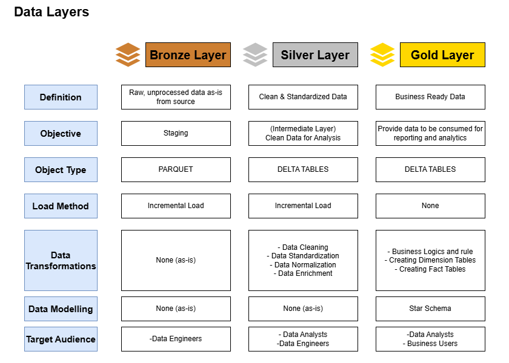
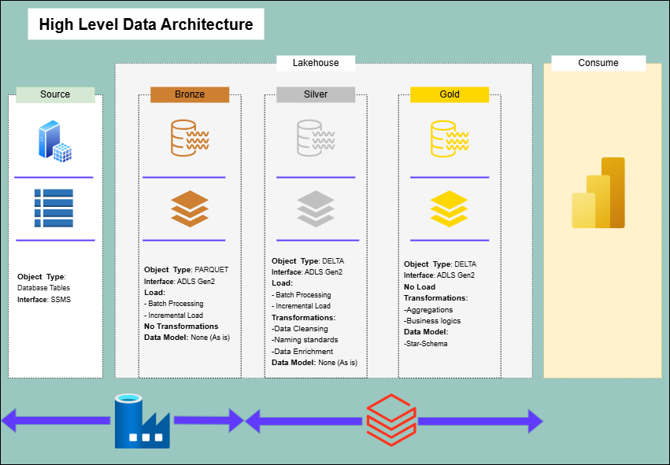
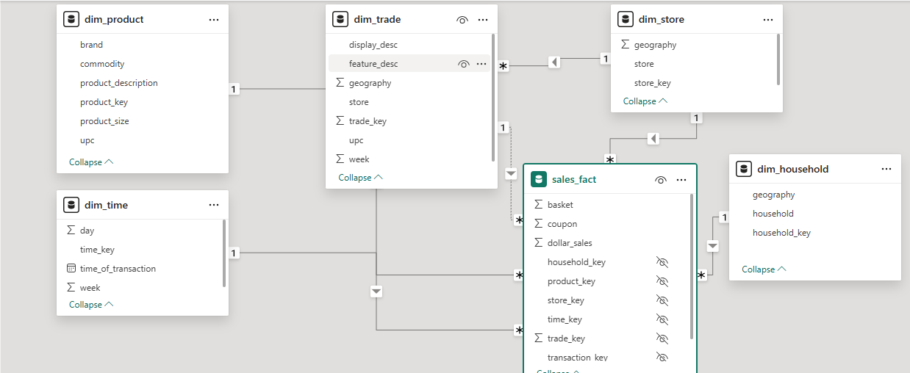
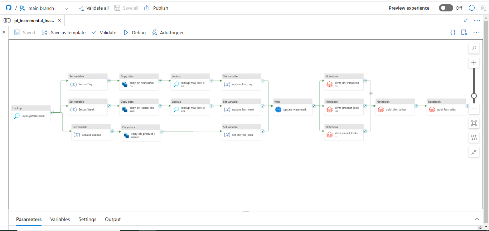

# Index

1. [Retail Analytics Pipeline Overview](#retail-analytics-pipeline-from-oltp-to-star-schema-in-a-lakehouse)
2. [Problem Statement](#problem-statement)
3. [Solution Overview](#solution-overview)
4. [Star Schema Design](#star-schema-design)
5. [Implementation](#implementation)
   - [Data Ingestion (Bronze Layer)](#1-data-ingestion-bronze-layer)
   - [Data Cleaning (Silver Layer)](#2-data-cleaning-silver-layer)
   - [Star Schema Creation (Gold Layer)](#3-star-schema-creation-gold-layer)
6. [Results](#results)
7. [CI/CD Pipeline](#cicd-pipeline)

---

# Retail Analytics Pipeline: From OLTP to Star Schema in a Lakehouse

This project showcases a robust data engineering pipeline that transforms raw transactional data from an OLTP system into a star schema optimized for retail analytics. Leveraging **SQL Server Management Studio (SSMS)** as the source, **Azure Data Factory (ADF)** for data orchestration, and **Azure Databricks** for transformation, it builds a scalable lakehouse architecture using a medallion structure (Bronze, Silver, Gold layers). The dataset, sourced from dunnhumby’s **Carbo-Loading** dataset, includes household-level transactions for products like pasta, pasta sauce, syrup, and pancake mix.

The goal is to enable actionable insights into customer behavior—such as household penetration, coupon effectiveness, and brand loyalty—through a well-structured star schema.

---

## Problem Statement

Retail businesses generate vast amounts of transactional data daily, stored in operational systems like SSMS. However, raw data from OLTP systems like SSMS poses challenges:
- **Normalization**: Data is scattered across multiple tables (e.g., `dh_transactions`, `dh_product_lookup`), complicating analytical queries.
- **Performance**: Queries on raw data are slow and resource-intensive.
- **Lack of Context**: Missing derived metrics and relationships hinder quick answers to business questions. Contains inconsistencies (e.g., duplicates, missing values)
- **Scales to millions of rows**: (e.g., 5,197,691 transactions over 2 years), requiring efficient processing.
- **Incremental Load**: - Needs incremental updates as new sales occur.

The challenge was to create a robust pipeline that:
**1.** Ingests transactional data from SSMS into a cloud storage system.
**2.** Cleans and organizes it for analytical use.
**3.** Supports incremental loads without duplicating or losing data.
**4.** Enables fast, scalable querying via a star schema.

---

## Solution Overview

The solution is an **end-to-end data pipeline** built on **Azure Data Lake Storage Gen2 (ADLS Gen2)**, orchestrated by **Azure Data Factory (ADF)**, and processed using **Apache Spark** in **Databricks**. It adopts the **Medallion Architecture** to transform data across three layers, culminating in a star schema optimized for analytics.

#### Components
1. **Source (SSMS - OLTP)**:
   - Transactional data from `dh_transactions` (5M+ rows), `dh_product_lookup` (927 rows), and `dh_causal_lookup` (351K rows).
2. **Ingestion (Azure Data Factory)**:
   - Extracts data from SSMS and loads it into ADLS Gen2.
3. **ADLS Gen2 (Storage)**:
   - Hosts the Medallion layers: Bronze, Silver, and Gold.
4. **Medallion Architecture**:
   - **Bronze Layer**: Raw data stored "as is" from SSMS in Delta format.
   - **Silver Layer**: Cleaned and deduplicated data, ready for transformation.
   - **Gold Layer**: Star schema with:
     - **Fact Table**: `sales_fact` (measures: `dollar_sales`, `units`, `coupon`; degenerate: `basket`).
     - **Dimension Tables**: `dim_time`, `dim_product`, `dim_household`, `dim_store`, `dim_trade`.
5. **Processing (Databricks)**:
   - Spark jobs transform data across layers, generate surrogate keys, and handle incremental loads using Delta Lake’s `merge`.

#### Key Features
- **Incremental Loads**: Uses a hash-based `transaction_key` (bigint) for stable merging, ensuring new sales update the fact table without duplicates.
- **Scalability**: Handles 5M+ rows efficiently with Spark and Delta Lake optimizations.
- **Data Quality**: Silver layer cleans raw data (e.g., deduplicates `dh_transactions`).
- **Analytics-Ready**: Gold layer’s star schema supports fast queries for BI tools like Power BI.

### Star Schema Design
- **Fact Table**: `SalesFact`
  - **Grain**: One row per transaction.
  - **Measures**: `DollarSales`, `UnitsSold`, `CouponUsed`.
  - **Foreign Keys**: `DateKey`, `ProductKey`, `HouseholdKey`, `StoreKey`, `TradeKey`.
- **Dimension Tables**:
  - `TimeDim`: Time details (day, week, time of day).
  - `ProductDim`: Product info (UPC, brand, category).
  - `HouseholdDim`: Household attributes (ID, geography).
  - `StoreDim`: Store info (ID, location).
  - `TradeDim`: Promotion details (displays, campaigns).

This design supports fast, flexible querying to answer the business questions effectively.

---

## Implementation

### 1. Data Ingestion (Bronze Layer)
- **Tool**: Azure Data Factory.
- **Process**: ADF pipelines extract data from SSMS and store them in ADLS Gen2 under `/bronze`.

### 2. Data Cleaning (Silver Layer)
- **Tool**: Azure Databricks (PySpark).
- **Process**:
  - Load raw CSVs from `/bronze`.
  - Clean data (e.g., handle null values in `upc`, standardize formats).
  - Save as Delta tables in `/silver`.

### 3. Star Schema Creation (Gold Layer)
- **Tool**: Azure Databricks (Pyspark).
- **Process**:
  - **Dimensions**: Generate surrogate keys (e.g., `ROW_NUMBER()` for `ProductKey`) and populate tables like `TimeDim`, `ProductDim`.
  - **Facts**: Join `dh_transactions` with dimensions, replacing natural keys with surrogate keys to build `SalesFact`.
  - Store results as Delta tables in `/gold`.
 
## Results
- **Problem Solved**: Transformed 5M+ raw transactions into an analytics-ready star schema, enabling insights into sales trends, coupon usage, and customer behavior.
- **Efficiency**: Incremental loads ensure only new data is processed, reducing runtime and costs.
- **Scalability**: Azure and Delta Lake handle large datasets with ease.
- **Stability**: Hash-based `transaction_key` ensures consistent updates across runs.

---

## CI/CD Pipeline

This project uses GitHub Actions to automate CI/CD for Azure Data Factory (ADF) and Azure Databricks.
- **CI:** Validates and packages code on every push to `main`. The workflow ensures Databricks notebooks (`.ipynb` and `.py`) and ADF ARM templates are ready for deployment by checking out the repository and preparing the necessary tools (Databricks CLI and Azure CLI).
- **CD:** Deploys to `adf-carbo-uat` (ADF UAT instance) and `ws-carbo` (Databricks workspace). The pipeline pushes notebooks to the `/carbo-loading-UAT` folder in Databricks and updates ADF pipelines in `adf-carbo-uat` using an ARM template with an overridden `factoryName`.

Check the [Actions tab](https://github.com/abhinavrai10/carbo_loading/actions) to see it live!
